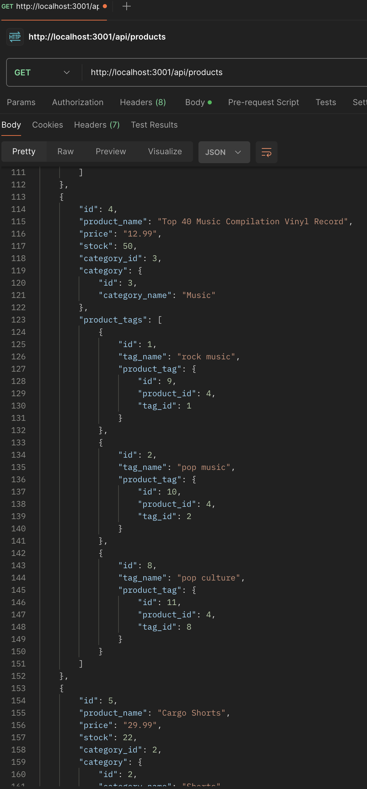
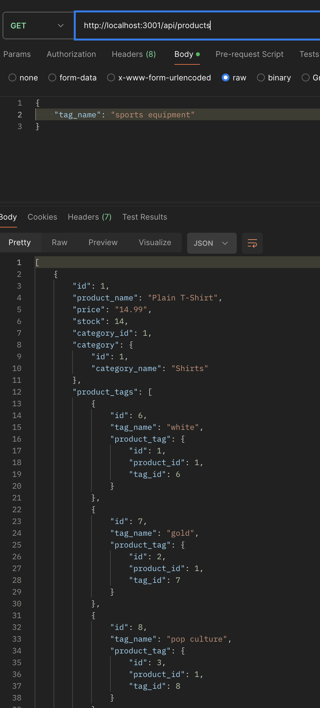
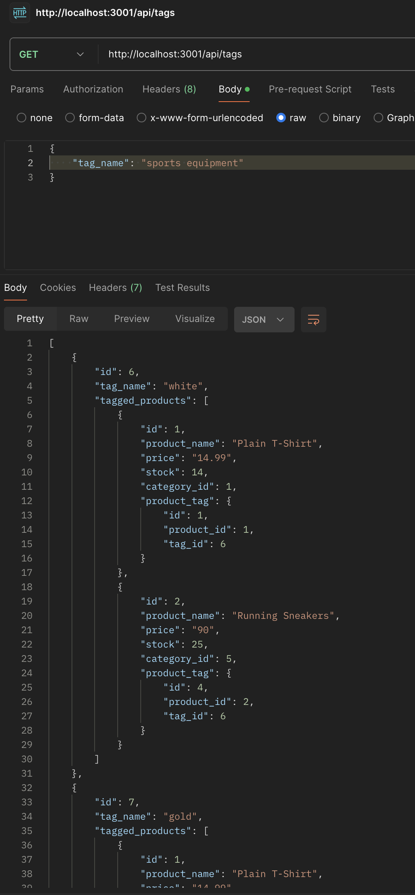
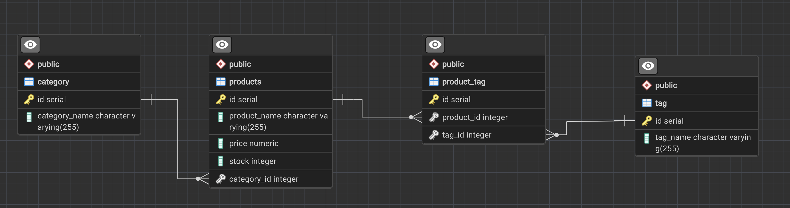
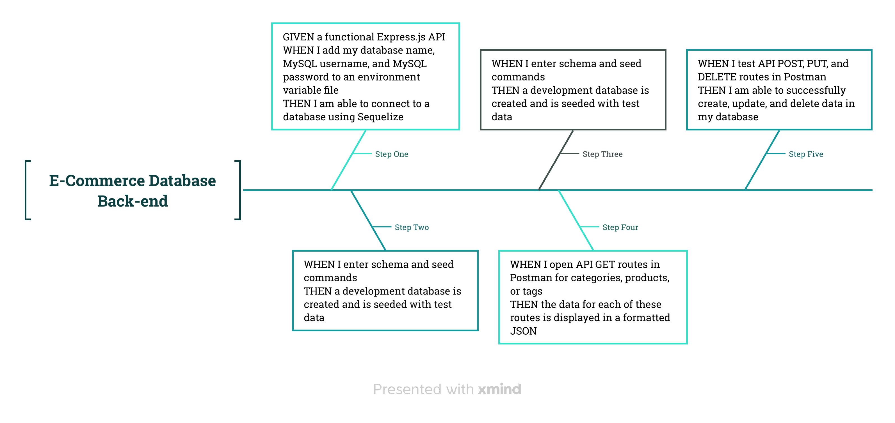

<a name="readme-top"></a>

[![Contributors][contributors-shield]][contributors-url]
[![Forks][forks-shield]][forks-url]
[![Stargazers][stars-shield]][stars-url]
[![Issues][issues-shield]][issues-url]
[![MIT License][license-shield]][license-url]
[![LinkedIn][linkedin-shield]][linkedin-url]
</br>

<br />
<div align="center">
  <a href="https://github.com/beckpull/e-commerce-db">


<h1 align="center">E-Commerce Database Integration</h1>

  <p align="center">
This is an example of some back-end processes one could use for their e-commerce website (which uses the latest technologies) to enable their company to compete with other e-commerce companies
    <br />
    <a href="https://github.com/beckpull/e-commerce-db"><strong>Explore the docs »</strong></a>
    <br />
    <br />
    <a href="https://drive.google.com/file/d/1Tv-WVJPkxhrQiLhGpHmbhtl6tIY7OvaY/view">View Demo</a>
    ·
    <a href="https://github.com/beckpull/e-commerce-db/issues">Report Bug</a>
    ·
    <a href="https://github.com/beckpull/e-commerce-db/issues">Request Feature</a>
  </p>
</div>

</br>
</br>

<!-- TABLE OF CONTENTS -->
<details>
  <summary>Table of Contents</summary>
  <ol>
    <li>
      <a href="#about-the-project">About The Project</a>
      <ul>
        <li><a href="#built-with">Built With</a></li>
      </ul>
    </li>
    <li>
      <a href="#getting-started">Getting Started</a>
      <ul>
        <li><a href="#prerequisites">Prerequisites</a></li>
        <li><a href="#installation">Installation</a></li>
      </ul>
    </li>
    <li><a href="#usage">Usage</a></li>
    <li><a href="#roadmap">Roadmap</a></li>
    <li><a href="#contributing">Contributing</a></li>
    <li><a href="#license">License</a></li>
    <li><a href="#contact">Contact</a></li>
     <li><a href="#acknowledgments">Acknowledgments</a></li>
  </ol>
</details>

</br>
</br>

<!-- ABOUT THE PROJECT -->
## About The Project

- This application is geared towards anybody looking for an easy-to-use database integration for their existing e-commerce website.

- The goal of this application is for companies to be able to easily keep track of and manage inventories and correlating items within their website. 

<p align="right">(<a href="#readme-top">back to top</a>)</p>


### Built With

* 
* ![NodeJS]
* 
* 
* 
* 


<p align="right">(<a href="#readme-top">back to top</a>)</p>

<!-- GETTING STARTED -->
## Getting Started

<p align="center"><i><strong>✨ Everything you need to know ✨</strong></i></p>

### Prerequisites

_This application has several dependencies, to install individually onto your machine, navigate to the directory this code lives in and type these commands into your Terminal / Git Bash:_
  ```sh
  npm i express
  npm i sequelize
  npm i pg
  npm i dotenv
  npm i nodemon --save-dev
  ```

### Installation

_To get a local copy up and running follow these simple example steps:_

1. Clone the repo
   ```sh
   HTTP: git clone https://github.com/beckpull/e-commerce-db.git
   SSH: git clone git@github.com:beckpull/e-commerce-db.git
   ```
2. Install all necessary NPM packages
   ```sh
   npm i
   ```
3. Node `server.js`
   ```js
   node server.js
   ```

<p align="right">(<a href="#readme-top">back to top</a>)</p>

<!-- USAGE EXAMPLES -->
## Usage 
<!-- Link to video demo -->
 * **Click [here](https://drive.google.com/file/d/1Tv-WVJPkxhrQiLhGpHmbhtl6tIY7OvaY/view) or scan the below QR code to watch a demo video on how to use this application.**
</br></br>
<div align="center">
  <a href="https://github.com/beckpull/e-commerce-db">
      
  </a> 
  </br></br>
  <p><strong><i>The following are the example outputs:</i></strong></p>
  </br></br>
  <a href="https://github.com/beckpull/e-commerce-db">
   <p>GET /products:</p>
    
  </a>
  </br></br>
  <a href="https://github.com/beckpull/e-commerce-db">
    <p>GET /categories:</p>
    
  </a>
  </br></br>
  <a href="https://github.com/beckpull/e-commerce-db">
    <p>GET /tags:</p>
    
  </a>
</div>

<p align="right">(<a href="#readme-top">back to top</a>)</p>

<!-- ROADMAP -->
## Roadmap


<div align="right">
  <p><i>This was how I chose to set up my schema for this project</i></p>
</div>
</br></br></br>

<div align="right">
  <p><i>This was my roadmap to completing all of the acceptance criteria</i></p>
</div>
<!-- GIVEN a functional Express.js API
WHEN I add my database name, MySQL username, and MySQL password to an environment variable file
THEN I am able to connect to a database using Sequelize
WHEN I enter schema and seed commands
THEN a development database is created and is seeded with test data
WHEN I enter the command to invoke the application
THEN my server is started and the Sequelize models are synced to the MySQL database
WHEN I open API GET routes in Insomnia Core for categories, products, or tags
THEN the data for each of these routes is displayed in a formatted JSON
WHEN I test API POST, PUT, and DELETE routes in Insomnia Core
THEN I am able to successfully create, update, and delete data in my database -->

<p align="right">(<a href="#readme-top">back to top</a>)</p>

<!-- CONTRIBUTING -->
## Contributing

Contributions are what make the open source community such an amazing place to learn, inspire, and create. Any contributions you make are **greatly appreciated**!

_If you have a suggestion that would make this better, please fork the repo and create a pull request. You can also simply open an issue with the tag "enhancement".
Don't forget to give the project a star! Thanks again!_

1. Fork the Project
2. Create your Feature Branch (`git checkout -b feature/NewFeature`)
3. Commit your Changes (`git commit -m 'Added ______ , NewFeature'`)
4. Push to the Branch (`git push origin feature/NewFeature`)
5. Open a Pull Request

See the [open issues](https://github.com/beckpull/e-commerce-db/issues) for a full list of proposed features (and known issues).

<p align="right">(<a href="#readme-top">back to top</a>)</p>

<!-- LICENSE -->
## License

<p align='center'>Distributed under the MIT License. See `LICENSE.txt` for more information.</p>
<p align='center'>© Beck Feltman · All rights reserved.</p>

<p align="right">(<a href="#readme-top">back to top</a>)</p>

<!-- CONTACT -->
## Contact

**Rebecca Feltman** - [Email me](mailto:beckpull@icloud.com) - or check me out on [GitHub!](https://github.com/beckpull) 

>Repository Link: [https://github.com/beckpull/e-commerce-db](https://github.com/beckpull/e-commerce-db)


<p align="right">(<a href="#readme-top">back to top</a>)</p>

<!-- ACKNOWLEDGMENTS -->
## Acknowledgments

* This README file template was created by [@othneildrew](https://github.com/othneildrew) - the original can be found [here](https://github.com/othneildrew/Best-README-Template)
<!-- * Huge thank you to my tutor, [Dennis Itua](https://github.com/Dennis-The14th-web) and to my friend [@NathaliaReyes](https://github.com/nathaliareyes) for all of your help and support through this and every project ✨ -->

#### Disclaimer: 
> I utilized several articles from sources such as (but not limited to) Stack Overflow, W3Schools, and MDN Web Docs **as references** for the javascript code attached. 
>
**All of the utilized information has been altered in order to fit this project. This repository contains some modified Denver University start code and _solely_ my own work on the backend.** 
<p align="right">(<a href="#readme-top">back to top</a>)</p>


<!-- MARKDOWN LINKS & IMAGES -->
<!-- https://www.markdownguide.org/basic-syntax/#reference-style-links -->
[contributors-shield]: https://img.shields.io/github/contributors/beckpull/e-commerce-db.svg?style=for-the-badge
[contributors-url]: https://github.com/beckpull/e-commerce-db/graphs/contributors
[forks-shield]: https://img.shields.io/github/forks/beckpull/e-commerce-db.svg?style=for-the-badge
[forks-url]: https://github.com/beckpull/e-commerce-db/network/members
[stars-shield]: https://img.shields.io/github/stars/beckpull/e-commerce-db.svg?style=for-the-badge
[stars-url]: https://github.com/beckpull/e-commerce-db/stargazers
[issues-shield]: https://img.shields.io/github/issues/beckpull/e-commerce-db.svg?style=for-the-badge
[issues-url]: https://github.com/beckpull/e-commerce-db/issues
[license-shield]: https://img.shields.io/github/license/beckpull/e-commerce-db.svg?style=for-the-badge
[license-url]: https://github.com/beckpull/e-commerce-db/blob/main/LICENSE
[product-screenshot]: images/screenshot.png
[NodeJS]: https://img.shields.io/badge/node.js-6DA55F?style=for-the-badge&logo=node.js&logoColor=white
[Node-url]: https://nodejs.org/en
[JQuery.com]: https://img.shields.io/badge/jQuery-0769AD?style=for-the-badge&logo=jquery&logoColor=white
[JQuery-url]: https://jquery.com 
[Bulma]: https://img.shields.io/badge/bulma-00D0B1?style=for-the-badge&logo=bulma&logoColor=white
[linkedin-shield]: https://img.shields.io/badge/linkedin-%230077B5.svg?style=for-the-badge&logo=linkedin&logoColor=white
[linkedin-url]: https://linkedin.com/in/beckpull/
[stackoverflow-shield]: https://img.shields.io/badge/-Stackoverflow-FE7A16?style=for-the-badge&logo=stack-overflow&logoColor=white
[jest-shield]: https://img.shields.io/badge/-jest-%23C21325?style=for-the-badge&logo=jest&logoColor=white
[inquirer-shield]: https://img.shields.io/badge/dependency-inquirer-black
[inquirer-url]: https://www.npmjs.com/package/inquirer